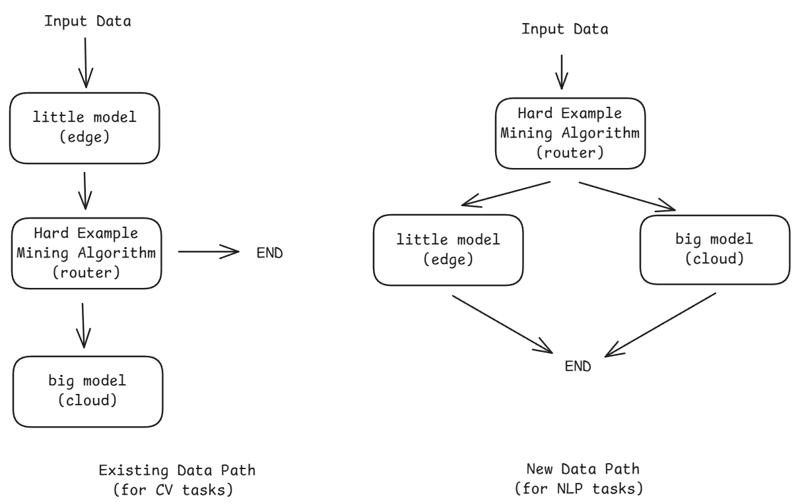

# Proposal: Migrate the Joint Inference Example for LLM from KubeEdge-Ianvs to KubeEdge-Sedna

This proposal outlines a project to migrate the Large Language Model (LLM) joint inference example from `kubeedge-ianvs` to `kubeedge-sedna`. The project will focus on implementing custom query routing algorithms for NLP tasks and creating the necessary `Estimator` classes and data handlers to support them.

## Background and Motivation

KubeEdge-Sedna excels at edge-cloud collaborative AI for Computer Vision (CV) tasks but lacks examples for the increasingly important domain of LLMs. The `kubeedge-ianvs` project already contains an example for LLM joint inference. This project aims to migrate that proven pattern to Sedna, enriching the Sedna ecosystem with a powerful, real-world example for developers looking to deploy collaborative LLMs on the edge.

## Goals

- Migrate the core functionality of the ianvs LLM joint inference example to Sedna.

- Implement custom Hard Example Mining (HEM) routing algorithms suitable for NLP tasks.

- Modify Sedna's data pipeline to enable routers to access raw input data, not just model inference results.

- Develop new Estimator classes and modular LLM handlers (HuggingfaceLLM, VllmLLM, etc.) for NLP workflows.

- Produce a complete and well-documented example, including code and configuration files.

## Design Details

The project will address two primary technical challenges:

### Custom Router and Data Path Modification

Sedna's existing routers (`HardExampleMining`) are designed for CV tasks and follow an "inference-then-mining" pattern, where the router can only access the inference result from the edge model. The ianvs example includes a `BERTFilter` which requires a "mining-then-inference" approach, needing access to the original input data to perform its routing logic.

Solution: I will modify `lib/sedna/core/joint_inference/joint_inference.py` to create a new data path. This will be configured via YAML to allow routing algorithms to optionally receive the raw data as input, enabling the implementation of `BERTFilter` and similar algorithms that follow the "mining-then-inference" pattern.

To support the new data path, I will add a new configuration item, `router_mode`, to the `JointInference` class. The `router_mode` can be set to either `inference-then-mining` or `mining-then-inference`, with `inference-then-mining` as the default value. 

This change will require updating the `pkg/apis/sedna/v1alpha1/jointinferenceservice_types.go` file to include the new configuration field.

### Support for NLP Tasks

Sedna's current Estimator classes and data modules are CV-focused. To handle LLMs, they must be adapted for text-based workflows.

Solution: I will:

- Create new Estimator classes specifically for NLP inference.

- Develop modular LLM handlers (e.g., `HuggingfaceLLM`, `VllmLLM`, `APIBasedLLM`) that can be reused by both edge and cloud models.

- Adapt Sedna's data management to handle text datasets.

## Project Plan

### Phase 1: Analysis and Design (Week 1)

1. **Requirements Analysis**
   - Study the LLM joint inference example in KubeEdge-Ianvs
   - Analyze Sedna's joint inference architecture
   - Identify necessary modifications for migration

2. **Design**
   - Design router modes and data flow paths
   - Plan Estimator class structures for NLP tasks
   - Outline LLM handler implementations

### Phase 2: Core Implementation (Weeks 2-3)

3. **Data Path Modification**
   - Modify `joint_inference.py` to support "mining-then-inference" mode
   - Update API definitions for new configuration options
   - Implement data routing logic changes

4. **NLP Support Implementation**
   - Develop NLP Estimator classes
   - Implement basic LLM handlers (HuggingfaceLLM, VllmLLM)
   - Create text data processing functionality

### Phase 3: Integration and Testing (Weeks 4-5)

5. **Integration**
   - Integrate new components with Sedna framework
   - Implement BERTFilter router
   - Create complete joint inference pipeline for LLMs

6. **Testing and Documentation**
   - Develop essential tests for new components
   - Write detailed documentation and usage examples
   - Create example configurations

### Deliverables

1. Modified Sedna components supporting NLP-based joint inference
2. NLP Estimator classes and LLM handlers
3. Custom routing algorithms for NLP tasks
4. Working example implementation with configuration files
5. Detailed documentation and usage guide

