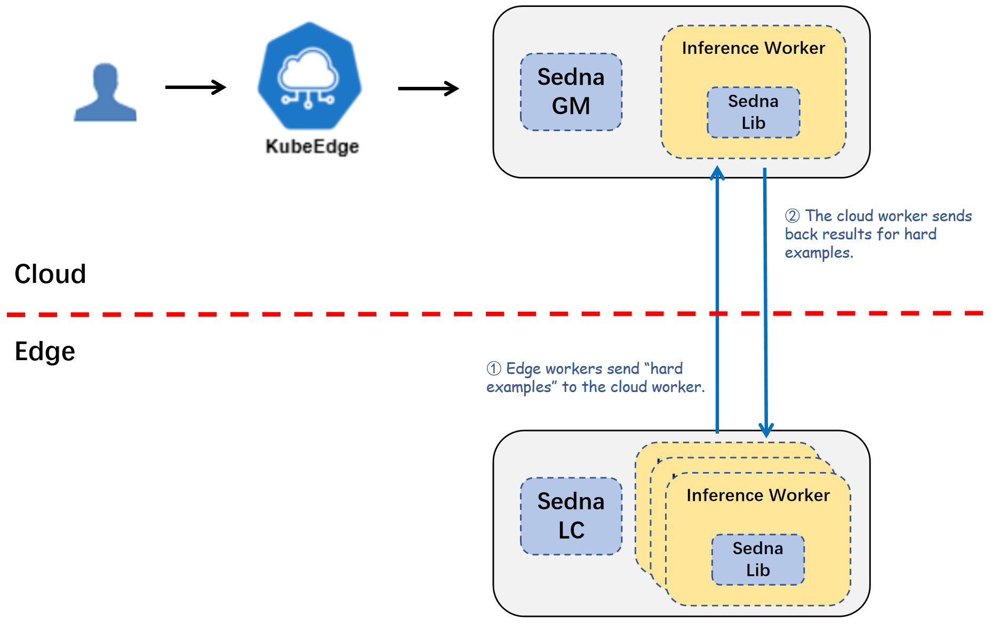
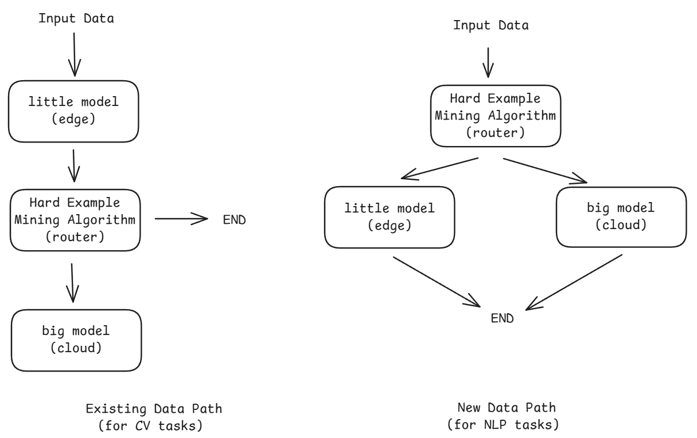

# Proposal: Migrate the Joint Inference Example for LLM from KubeEdge-Ianvs to KubeEdge-Sedna

This proposal outlines a project to migrate the Large Language Model (LLM) joint inference example from `kubeedge-ianvs` to `kubeedge-sedna`. The project will focus on implementing custom query routing algorithms for NLP tasks and creating the necessary `Estimator` classes and data handlers to support them.

## Background and Motivation

KubeEdge-Sedna excels at edge-cloud collaborative AI for Computer Vision (CV) tasks but lacks examples for the increasingly important domain of LLMs. The `kubeedge-ianvs` project already contains an example for LLM joint inference. This project aims to migrate that proven pattern to Sedna, enriching the Sedna ecosystem with a powerful, real-world example for developers looking to deploy collaborative LLMs on the edge.

## Goals

- Migrate the core functionality of the ianvs LLM joint inference example to Sedna.

- Implement custom Hard Example Mining (HEM) routing algorithms suitable for NLP tasks.

- Modify Sedna's data pipeline to enable routers to access raw input data, not just model inference results.

- Develop new Estimator classes and modular LLM handlers (HuggingfaceLLM, APIBasedLLM, etc.) for NLP workflows.

- Produce a complete and well-documented example, including code and configuration files.

## Design Details

### Architecture Overview

The architecture of the joint inference system will consist of:
- **Edge Worker**: A lightweight model running on edge devices, responsible for lightweight inference and routing decisions.
- **Cloud Worker**: A more powerful model running in the cloud, handling complex inference tasks and generating more accurate results. As api-based LLMs are often used, this worker will also include API-based LLM handlers.



### Custom Router and Data Path Modification

Sedna's existing routers (`HardExampleMining`) are designed for CV tasks and follow an "inference-then-mining" pattern, where the router can only access the inference result from the edge model. The ianvs example includes a `BERTFilter` which requires a "mining-then-inference" approach, needing access to the original input data to perform its routing logic.

I will reference the implementation in https://github.com/kubeedge/ianvs/blob/main/examples/resources/third_party/sedna-0.6.0.1-py3-none-any.whl to introduce relevant features. By adding an optional `mining_mode` parameter to the `inference` method of the `JointInference` class (with values "inference-then-mining" or "mining-then-inference", defaulting to the former to ensure seamless compatibility with existing examples), I will enable `JointInference` to flexibly switch between these paths during inference.



### Support for NLP Tasks

Sedna's current Estimator classes and data modules are CV-focused. To handle LLMs, they must be adapted for text-based workflows.

Solution: I will:

- Create new Estimator classes specifically for NLP inference.

- Develop modular LLM handlers (e.g., `HuggingfaceLLM`, `APIBasedLLM`) that can be reused by both edge and cloud models.

- Adapt Sedna's data management to handle text datasets.

### Implementation Details

Files to be added include:

```
|- examples
|   |- joint_inference
|      |- answer_generation_inference
|         |- big_model
|            |- interface.py
|            |- big_model.py
|         |- little_model
|            |- interface.py
|            |- little_model.py
|         answer_generation_inference.yaml
|         README.md
```

The `interface.py` files will define the `Estimator` classes for the edge and cloud models, while the `big_model.py` and `little_model.py` files will create and launch the `BigModelService` and `JointInference` instances. The `Estimator` classes will automatically load models from local storage, URLs, or switch to API-based LLMs based on configuration settings.

Files to be modified include:
```
|- lib
|   |- sedna
|      |- algorithms
|         |- hard_example_mining.py
|      |- backend
|         |- torch
|            |- __init__.py
|      |- core
|         |- joint_inference.py
```

The modification to `hard_example_mining.py` will focus on adding several new hard-example-mining algorithms: `BertRouter`, `EdgeOnly`, and `CloudOnly`. These new algorithms will be implemented as separate classes and will not affect existing algorithms, ensuring backward compatibility.

The modification to `torch/__init__.py` and `joint_inference.py` aims to enable the framework to support importing URL-based models, rather than only local model weights. This will only involve minor modifications to judgment conditions without changing the main logic, and should not affect existing examples.

## Project Plan

### Phase 1: Analysis and Design (Week 1)

1. **Requirements Analysis**
   - Study the LLM joint inference example in KubeEdge-Ianvs
   - Analyze Sedna's joint inference architecture
   - Identify necessary modifications for migration

2. **Design**
   - Design router modes and data flow paths
   - Plan Estimator class structures for NLP tasks
   - Outline LLM handler implementations

### Phase 2: Core Implementation (Weeks 2-3)

3. **Data Path Modification**
   - Modify `joint_inference.py` to support "mining-then-inference" mode
   - Update API definitions for new configuration options
   - Implement data routing logic changes

4. **NLP Support Implementation**
   - Develop NLP Estimator classes
   - Implement basic LLM handlers (HuggingfaceLLM, VllmLLM)
   - Create text data processing functionality

### Phase 3: Integration and Testing (Weeks 4-5)

5. **Integration**
   - Integrate new components with Sedna framework
   - Implement BERTFilter router
   - Create complete joint inference pipeline for LLMs

6. **Testing and Documentation**
   - Develop essential tests for new components
   - Write detailed documentation and usage examples
   - Create example configurations

### Deliverables

1. Modified Sedna components supporting NLP-based joint inference
2. NLP Estimator classes and LLM handlers
3. Custom routing algorithms for NLP tasks
4. Working example implementation with configuration files
5. Detailed documentation and usage guide


